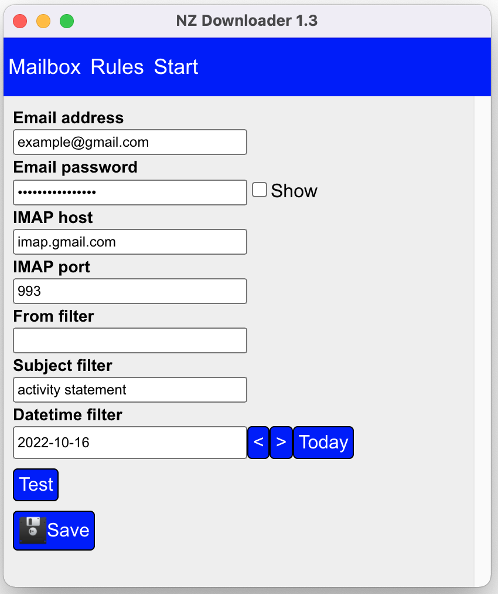
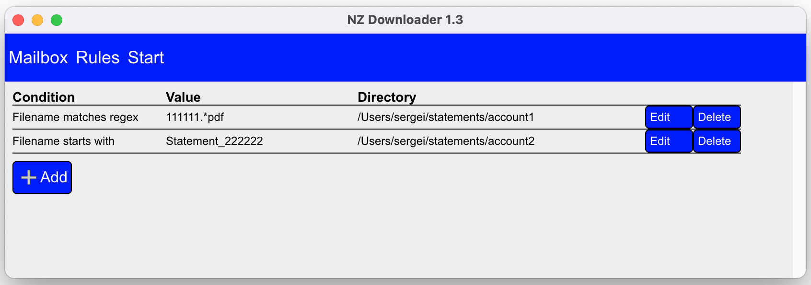
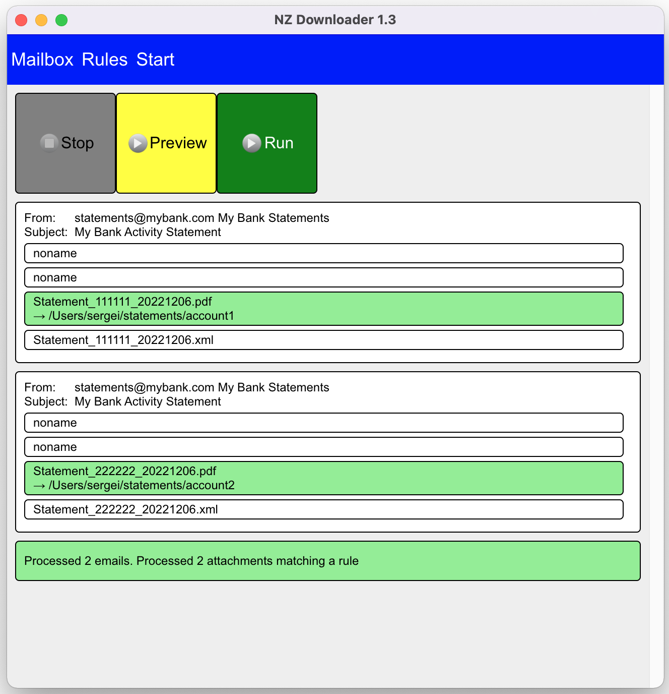

# NZ Downloader

## Description

NZ Downloader is a desktop application that can download email attachments via IMAP and save them
to local directories according to configurable rules.

## Developer documentation

### Build app (macOS)

npm run make
### Run app (macOS)

open out/nz-downloader-darwin-x64/nz-downloader.app

### Kill app (macOS)

killall nz-downloader

### Read logs for the main process

tail -f ~/Library/Application\ Support/nz-downloader/out.log

### Inspect database state

subl ~/Library/Application\ Support/nz-downloader/db.json

### Clear database state

rm ~/Library/Application\ Support/nz-downloader/db.json
